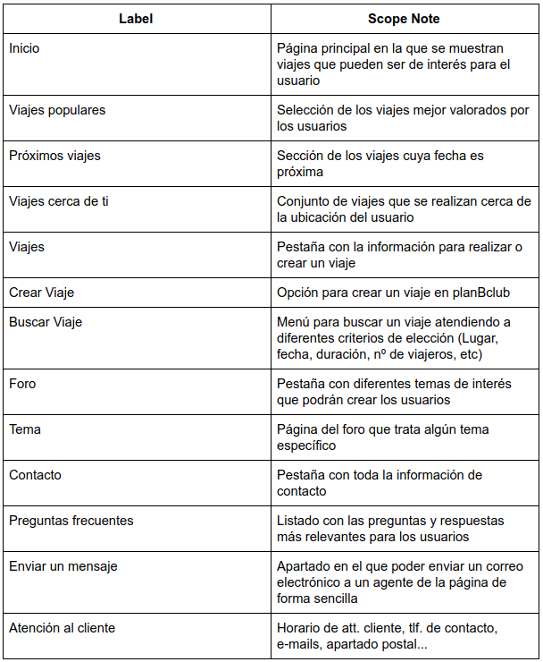
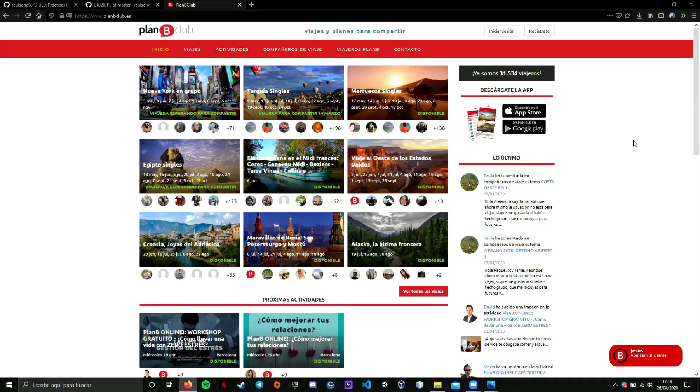

# DIU20
Prácticas Diseño Interfaces de Usuario 2019-20 (Economía Colaborativa) 

Grupo: DIU1.Hookah  Curso: 2019/20 

Proyecto: PlanBClub

Descripción: Vamos a analizar e intentar mejorar la web de PlanBClub

Logo: </img>

Miembros
 * :bust_in_silhouette:   Raúl Soria González     :octocat:     
 * :bust_in_silhouette:  Enrique Ruiz Limones     :octocat:

----- 

En esta práctica estudiaremos un caso de plataforma de economía colaborativa y realizaremos una propuesta para su diseño Web/movil. Utilizaremos herramientas y entregables descritos en el siguiente CheckList (https://github.com/mgea/UX-DIU-Checklist) 

Qué es economia colaborativa: Martínez-Polo, J. (2019). **El fenómeno del consumo colaborativo: del intercambio de bienes y servicios a la economía de las plataformas**, *Sphera Publica, 1*(19), 24-46. http://sphera.ucam.edu/index.php/sphera-01/article/view/363/14141434

>>> Este documento es el esqueleto del report final de la práctica. Aparte de subir cada entrega a PRADO, se debe actualizar y dar formato de informe final a este documento online. 

# Proceso de Diseño 

## Paso 1. UX Desk Research & Analisis 

 1.a Competitive Analysis
-----

Hemos elegido una aplicación web llamada ***Plan B Club*** cuyo propósito es la organización de viajes. Te da la posibilidad de realizar un viaje con tus amigos o familiares, o bien para conocer gente nueva con la que viajar.

 1.b Persona
-----

Hemos elegido a [Jon][Persona Jon] porque es una persona con la que nos identificamos, podría ser alguno de nosotros dos.

A [Dana][Persona Dana] la hemos elegido porque sus motivos para viajar y descubrir España son interesantes.

 1.c User Journey Map
----

Hemos escogido la UX de Jon porque es algo que nos puede pasar a todos, planear un viaje y no ponerse de acuerdo con tus compañeros de viaje. [Journey Map Jon][Mapa Jon]

Tabién hemos elegido la UX de Dana ya que se enfrenta a una situación frustrante en la que sus amigas la dejan tirada. [Journey Map Dana][Mapa Dana]

 1.d Usability Review
----

- Enlace al documento:  [Usability Review](P1/Usability-review.pdf)
- Valoración final (numérica): 61/100 - *Moderate*
- Comentario sobre la valoración: Es una página cuya idea está muy bien pero su interfaz no ayuda a la experiencia de usuario.

## Paso 2. UX Design  

 2.a Feedback Capture Grid
----

Lo más importante sería corregir la página de inicio ya que está sobrecargada y muy poco legible

 2.b Tasks & Sitemap 
-----

 2.c Labelling 
----

 2.d Wireframes
-----
Aquí dejamos los enlaces a los bocetos más importantes de la página web
### Pagina Inicio
[Boceto página de inicio][Boceto inicio]
### Pagina Buscar Viaje
[Boceto página de busqueda de viaje][Boceto buscar viaje]
### Pagina Tema Foro
[Boceto página de tema de foro][Boceto tema]

## Paso 3. Mi equipo UX-Case Study 

  3.a Logotipo
----
</img>

Hemos mantenido el logotipo inicial de la página porque nos parece que concuerda bien con la página en sí

 3.b Análisis de MuseMap y Guidelines
----
Toda la información queda recogida en la [carpeta P3](P3)

  3.c Video
----

[Enlace video][video]

## Paso 4. Evaluación 

 4.a Casos asignados
----

### Caso 1 [DIU1.HORAPI][HORAPI]

Este equipo está analizando y mejorando la aplicación ***Travello***

Destacar que empezaron de forma algo floja con un *UX Desk Research & Analisis* muy pobre sobre todo su *Usability Review* que es bastante mejorable, aunque a partir del proceso de *UX Design* se ha notado una gran mejoría y mayor dedicación. Esto se refleja en los bocetos, el logotipo o los *guidelines*.

Puntuación: 66

### Caso 2 [DIU2.M&J][M&J]

Este equipo de centra en el análisis de ***Airbnb***

La estructura del README es extremadamente mala. No sigue la organización que se pedía y hay que ir buscando por todo el documento para encontrar los distintos apartados. Además hay algunas cosas que ni siquiera aparecen en el github. Aunque es cierto que las cosas que están hechas están a un gran nivel.

Puntuación: 61

### Caso 3 [DIU3.KIMOA][KIMOA]

Este equipo ha analizado ***Eatwith***

Se nota que han dedicado bastante tiempo a cada apartado, se sigue una buena estructura a la hora de mostrar los contenidos. El *README* principal está algo desactualizado, la P3 no está y faltan algunas cosas de las anteriores.

Puntuación: 79

 4.b User Testing
----

### **Describe la experiencia 1**

Dana en el caso 1 (Viamos) ha visto una ciudad de España en la aplicación, pero a la hora de entrar al apartado de dicha ciudad la inormación relacionada con esa ciudad es nula, por tanto tiene que acudir a otra página para obtener la información acerca de dicha ciudad.

### **Describe la experiencia 2**

Dana en el caso 2 (Airbnb) quiere buscar algún alojamiento que compartir con más estudiantes a la hora de hacer un viaje, pero no encuentra ninguna opción en la página de busqueda de alojamiento que se lo permita, tan sólo puede alojarse con personas que viajen con ella (amigas, familia). Viendo esta situación decide buscar alojamiento compartido en otra aplicación.

### **Describe la experiencia 3**

Dana en el caso 3 (EatWith) quiere asistir a una clase de cómo hacer una paella con dos amigas más pero a la hora de inscribirse para realizar dicha clase no hay una opción para apuntarse con más amigas con lo que las amigas se tienen que crear una cuenta y apuntarse por su cuenta, lo que resulta mucho más tedioso. Probablemente no vuelvan a utilizar esta aplicación.

. 4.c Conclusión y Ranking 
----

Las tres páginas analizadas están bien, se nota que a partir de la segunda práctica las tres mejoraban considerablemente.

El grupo [DIU1.HORAPI][HORAPI] ha ido evolucionando considerablemente a mejor y como punto a destacar sus bocetos de aplicación nos han parecido geniales

El grupo [DIU2.M&J][M&J] tiene un README prácticamente ilegible que dificulta mucho su evaluación además les faltaban ciertos aprtados, sin embargo lo que estaba hecho estaba realmente bien hecho, destacando su Sitemap.

El grupo [DIU3.KIMOA][KIMOA] es el que mejor nivel ha mantenido desde el comienzo. Es el que mejor analisis ha realizado y sus explicaciones de cada apartado han sido muy buenas. Como punto a mejorar los bocetos son poco claros y muy saturados. El README principal está desactualizado y convendría mantenerlo al día

### ***RANKING***

**1./** [DIU3.KIMOA][KIMOA] - Puntuación: 79  
**2./** [DIU1.HORAPI][HORAPI] - Puntuación: 66  
**3./** [DIU2.M&J][M&J] - Puntuación: 61

## Paso 5. Evaluación de Accesibilidad  

  5.a Accesibility evaluation Report
----

>>> Indica qué pretendes evaluar (de accesibilidad) y qué resultados has obtenido + Valoración personal

>>> Evaluación de la Accesibilidad (con simuladores o verificación de WACG) 

## Conclusión final / Valoración de las prácticas

>>> (90-150 palabras) Opinión del proceso de desarrollo de diseño siguiendo metodología UX y valoración (positiva /negativa) de los resultados obtenidos  

[Persona Jon]:img/Persona_Jon.png
[Persona Dana]:img/Persona_Dana.png
[Mapa Jon]:img/Mapa_Jon.png
[Mapa Dana]:img/Mapa_Dana.png
[Boceto inicio]:img/boceto_inicio.jpg
[Boceto buscar viaje]:img/boceto_buscar_viaje.jpg
[Boceto tema]:img/boceto_tema.jpeg
[video]: img/Explicacion.mp4

[HORAPI]:https://github.com/diegogaraur/DIU20
[M&J]:https://github.com/MarioGenol/DIU20
[KIMOA]:https://github.com/Bagamo/DIUPRACTICAS