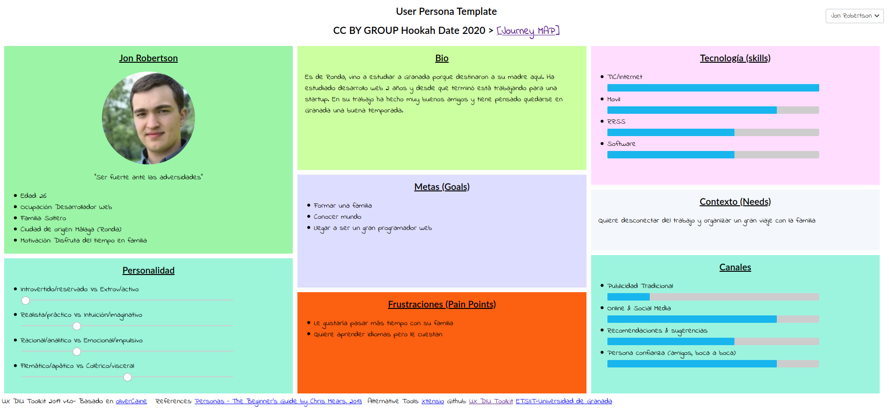

# DIU20
Prácticas Diseño Interfaces de Usuario 2019-20 (Economía Colaborativa) 

Grupo: DIU1.Hookah  Curso: 2019/20 

Proyecto: 

Descripción: 

Logotipo: 

Miembros
 * :bust_in_silhouette:   Raúl Soria González     :octocat:     
 * :bust_in_silhouette:  Enrique Ruiz Limones     :octocat:

----- 

En esta práctica estudiaremos un caso de plataforma de economía colaborativa y realizaremos una propuesta para su diseño Web/movil. Utilizaremos herramientas y entregables descritos en el siguiente CheckList (https://github.com/mgea/UX-DIU-Checklist) 

Qué es economia colaborativa: Martínez-Polo, J. (2019). **El fenómeno del consumo colaborativo: del intercambio de bienes y servicios a la economía de las plataformas**, *Sphera Publica, 1*(19), 24-46. http://sphera.ucam.edu/index.php/sphera-01/article/view/363/14141434

>>> Este documento es el esqueleto del report final de la práctica. Aparte de subir cada entrega a PRADO, se debe actualizar y dar formato de informe final a este documento online. 

# Proceso de Diseño 

## Paso 1. UX Desk Research & Analisis 

 1.a Competitive Analysis
-----

Hemos elegido una aplicación web llamada ***Plan B Club*** cuyo propósito es la organización de viajes. Te da la posibilidad de realizar un viaje con tus amigos o familiares, o bien para conocer gente nueva con la que viajar.

 1.b Persona
-----

Hemos elegido a Jon porque es una persona con la que nos identificamos, podría ser alguno de nosotros dos.

A Dana la hemos elegido porque sus motivos para viajar y descubrir España son interesantes.

 1.c User Journey Map
----

Hemos escogido la UX de Jon porque es algo que nos puede pasar a todos, planear un viaje y no ponerse de acuerdo con tus compañeros de viaje.

Tabién hemos elegido la UX de Dana ya que se enfrenta a una situación frustrante en la que sus amigas la dejan tirada.

 1.d Usability Review
----

- Enlace al documento:  [Usability Review](P1/Usability-review.pdf)
- Valoración final (numérica): 61/100 - *Moderate*
- Comentario sobre la valoración: Es una página cuya idea está muy bien pero su interfaz no ayuda a la experiencia de usuario.

## Paso 2. UX Design  

 2.a Feedback Capture Grid
----

Lo más importante sería corregir la página de inicio ya que está sobrecargada y muy poco legible

 2.b Tasks & Sitemap 
-----

 2.c Labelling 
----

 2.d Wireframes
-----

## Pagina Inicio

## Pagina Buscar Viaje

## Pagina Tema

## Paso 3. Mi equipo UX-Case Study 

 3.a ¿Como se cuenta un UX-Case Study?
-----

>>> Analizar lo aprendido de la experiencia MuseApp 

  3.b Logotipo
----

>>> Si diseña un logotipo, explique la herramienta utilizada y la resolución empleada. ¿Puede usar esta imagen como cabecera de Twitter, por ejemplo, o necesita otra?

 3.c Guidelines
----

>>> Tras documentarse, muestre las deciones tomadas sobre Patrones IU a usar para la fase siguiente de prototipado. 

  3.d Video
----

>>> Documente y resuma el diseño de su producto en forma de video de 90 segundos aprox

## Paso 4. Evaluación 

 4.a Casos asignados
----

>>> Descripción de las asignaciones (3 UX Case Study) y enlace a  sus repositorios.

>>>> En la seccioón P4/readme.md se debe acceder además a sus respectivas hojas de evaluación y conclusiones 

 4.b User Testing
----

>>> Seleccione a una de sus personas ficticias. Exprese las ideas de posibles situaciones conflictivas de esa persona en las propuestas evaluadas

. 4.c Ranking 
----

>>> Concluya con un ranking de los casos evaluados 

>>> Valoración personal 

## Paso 5. Evaluación de Accesibilidad  

  5.a Accesibility evaluation Report
----

>>> Indica qué pretendes evaluar (de accesibilidad) y qué resultados has obtenido + Valoración personal

>>> Evaluación de la Accesibilidad (con simuladores o verificación de WACG) 

## Conclusión final / Valoración de las prácticas

>>> (90-150 palabras) Opinión del proceso de desarrollo de diseño siguiendo metodología UX y valoración (positiva /negativa) de los resultados obtenidos  

